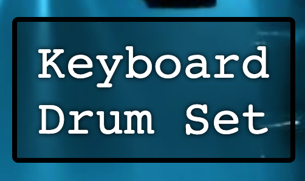

# 

## Description

The Keyboard Drum Set allows users to play sounds from a drum set by simply typing on their computer keyboard.


## Table of Contents

- [Technologies](#technologies)
- [Usage](#usage)

## Technologies


- HTML
- CSS
- JavaScript
  - audio files

## Usage

- [Deployed App](https://bridgetrshannon.github.io/Keyboard_Drum_Set/)
- [GitHub](https://github.com/bridgetrshannon/Keyboard_Drum_Set)

```
git clone https://github.com/bridgetrshannon/Keyboard_Drum_Set.git
```
